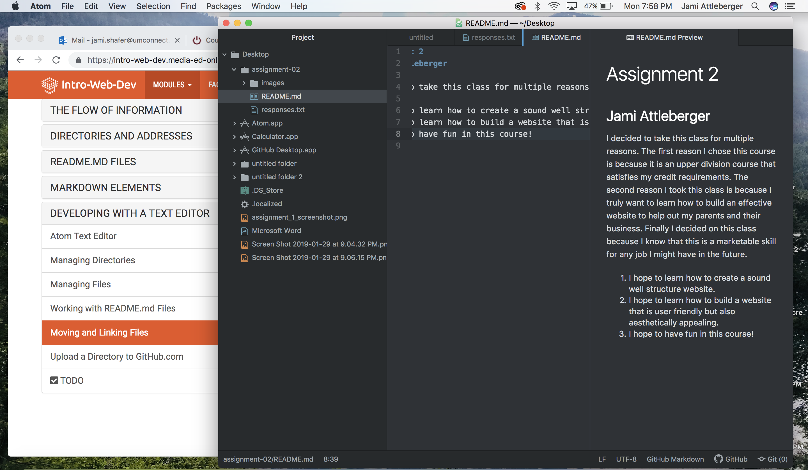

# Assignment 2
## Jami Attleberger

I decided to take this class for multiple reasons.  The first reason I chose this course is because it is an upper division course that satisfies my credit requirements.  The second reason I took this class is because I truly want to learn how to build an effective website to help out my parents and their business. Finally I decided on this class because I know that this is a marketable skill for any job I might have in the future.

1. I hope to learn how to create a sound well structure website.
2. I hope to learn how to build a website that is user friendly but also aesthetically appealing.
3. I hope to have fun in this course!

[Course Website](https://www.roomtoread.org/)

[My Responses](./responses.txt)

  
