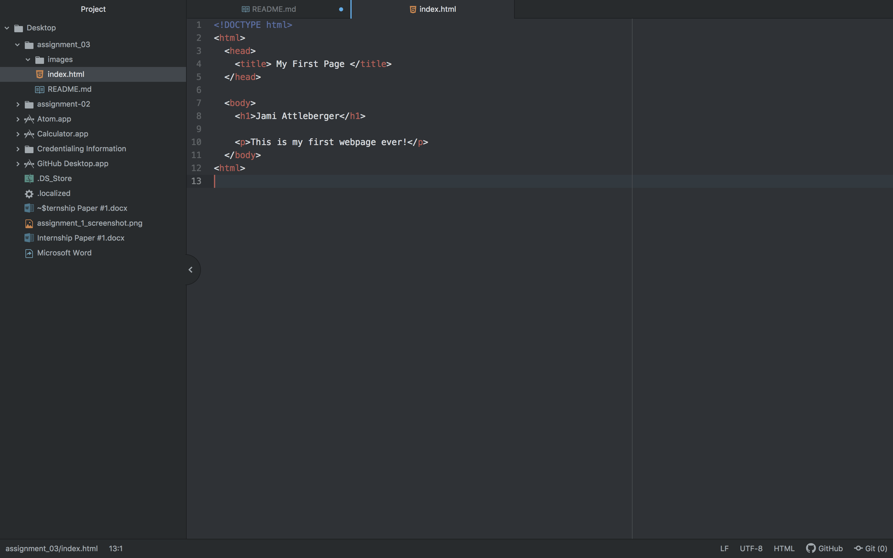

# Assignment 3
## Jami Attleberger

1) A web browser is a software program that is used to access the internet from a device. When you send a request over the internet the browser interprets the information requested and displays it to you using a combination of a rendering engine, a browser engine, JavaScript, and some sort of data storage tool which creates a document object model. I use 2 different browsers pretty regularly. I use safari most often since I have a Mac, but I also use google chrome as well. It just depends on what I'm doing and what information I am trying to access.

2) Markup language is a combination of text, design, and interactivity that helps form the structure of any webpage.

  
