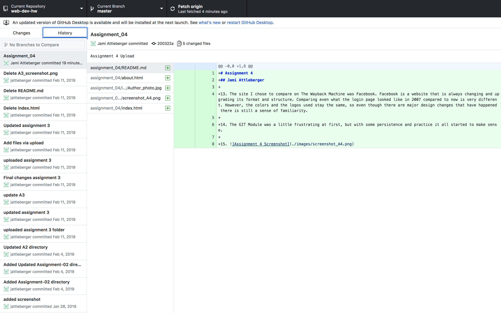

# Assignment 4
## Jami Attleberger

13. The site I chose to compare on The Wayback Machine was Facebook. Facebook is a website that is always changing and upgrading its format and structure. Comparing even what the login page looked like in 2007 compared to now is very different. However, the colors and the logos used stay the same, so even though there are major design changes that have happened there is still a sense of familiarity.

14. The GIT Module was a little frustrating at first, but with some persistence and practice it all started to make sense.

15. 
