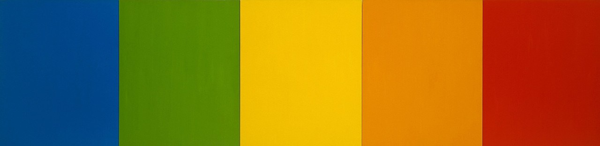

# Assignment 11
## Jami Attleberger
### Homework Questions

1. What is the difference between padding, margin, and borders?
    - Padding is used to create space between the content inside an element and the element itself.
    - Margins are used to create space between different elements, or the edges of parent elements.
    - Borders are used to define specific elements or distinguish the padding from the margin.

2. 

3. Work Summary:
    - The first thing that I did was choose an art piece to recreate. Once I did that I started on my html doc to set up the information I needed for my webpage. I created a separate div id for each color piece that I needed, and inserted those into a parent container named painting which is a div class. Once the bones were in place I then created a css doc to add the colors and texture to my webpage. I struggled for a little trying to figure out how to get my colors to show up on the webpage and realized that I had forgotten some pesky semi colons. Once I inserted those everything else fell into place.
